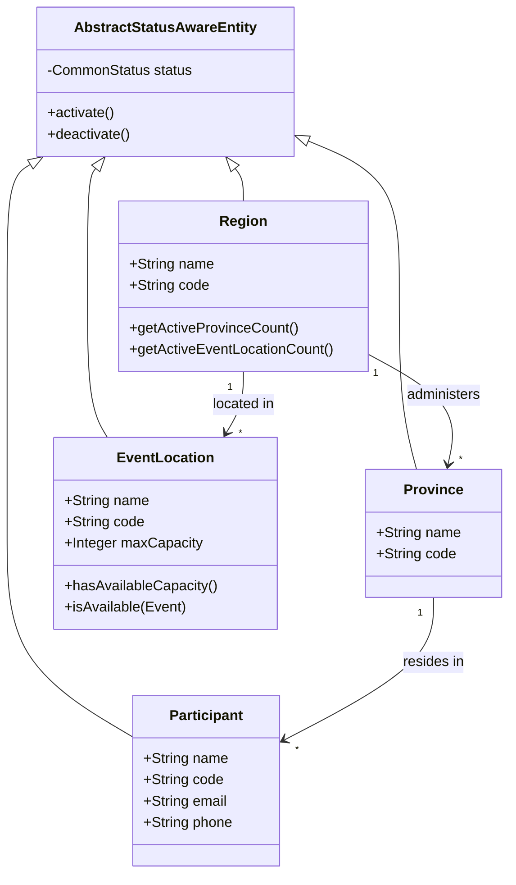
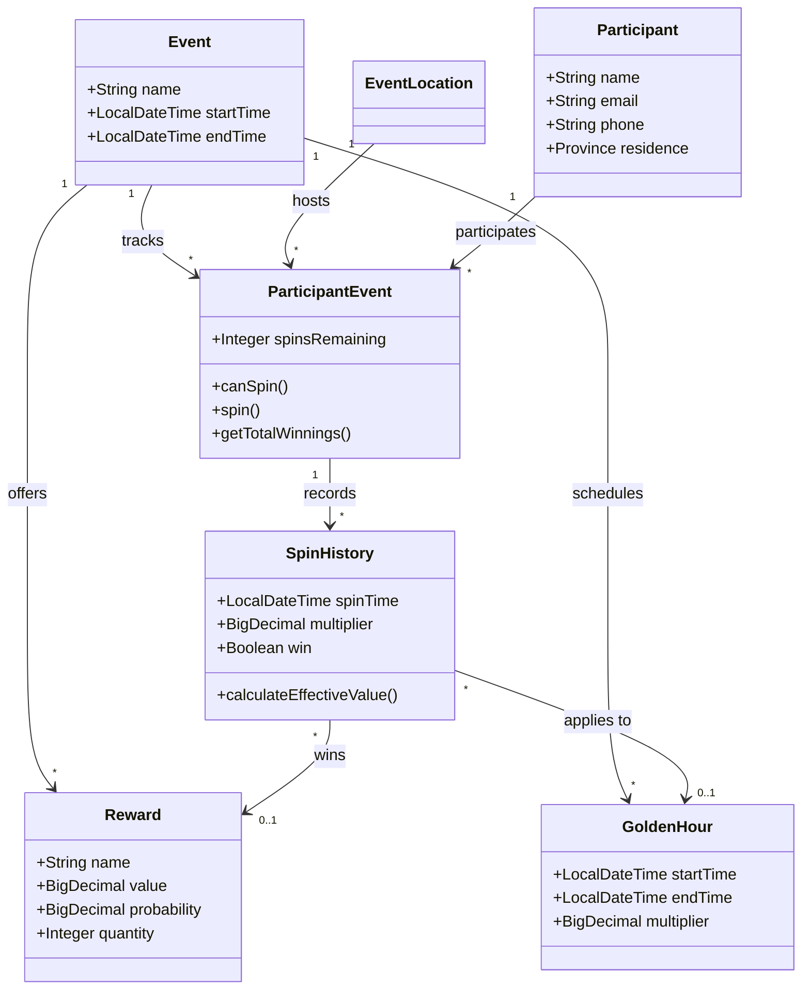
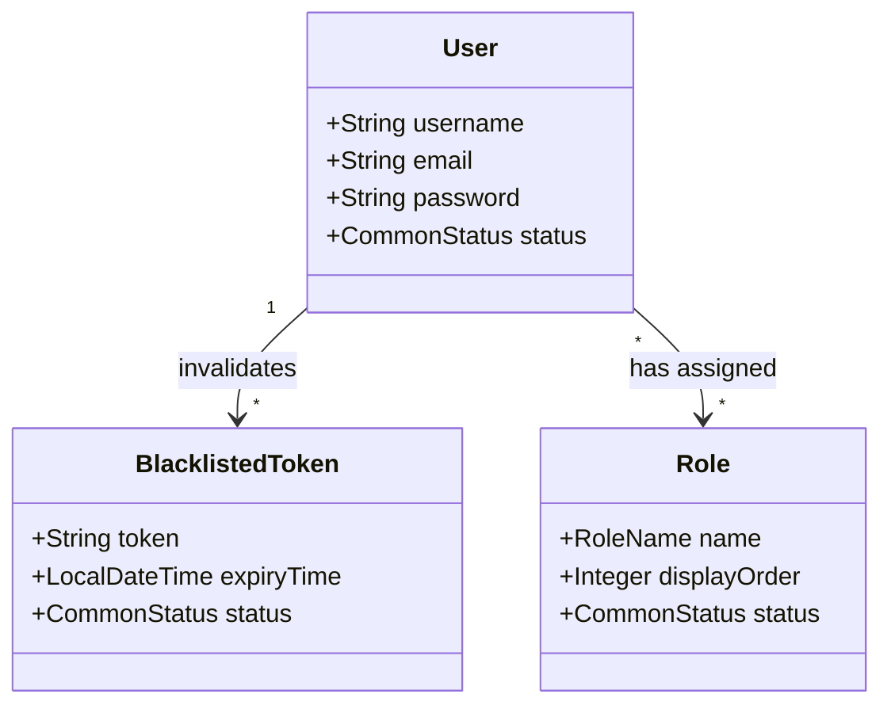

# Entity Classes Documentation

## Core Entities

### Region
- Represents a geographical region
- Has name, code and status attributes
- One-to-many relationships with:
  * Province (administrative hierarchy)
  * EventLocation (locations in the region)
- Used for high-level geographical organization
- Controls location availability and status

### Province
- Represents a province within a region
- Has name, code and status attributes
- Many-to-one relationship with Region
- One-to-many relationship with Participant (residents)
- Used for participant geographical organization

### Event
- Represents a promotional event
- Contains configuration for:
  * Time period (start/end time)
  * Event settings and status
- One-to-many relationships with:
  * EventLocation (where event operates)
  * Reward (prizes offered)
  * GoldenHour (bonus periods)
  * ParticipantEvent (participation records)

### EventLocation
- Represents a physical location where an event takes place
- Has name, code and capacity limits
- Many-to-one relationships with:
  * Event (which event is running)
  * Region (where location is situated)
- One-to-many relationship with ParticipantEvent (participation records)
- Manages capacity and participant tracking

### Participant
- Represents an individual participant
- Contains contact information
- Many-to-one relationship with Province (residence)
- One-to-many relationship with ParticipantEvent (event participation)
- Tracks participation across multiple events

### ParticipantEvent
- Links participants to events and locations
- Tracks spins remaining
- Many-to-one relationships with:
  * Event (which event)
  * EventLocation (where participated)
  * Participant (who participated)
- One-to-many relationship with SpinHistory (spin records)

### SpinHistory
- Records individual spins
- Contains spin time and result
- Many-to-one relationships with:
  * ParticipantEvent (participation context)
  * Reward (if won)
  * GoldenHour (if during bonus period)
- Tracks win/loss and multipliers

### Reward
- Represents available prizes
- Contains win probability and quantity tracking
- Many-to-one relationship with Event
- One-to-many relationship with SpinHistory (wins)

### GoldenHour
- Represents bonus periods during events
- Contains time period and multiplier
- Many-to-one relationship with Event
- One-to-many relationship with SpinHistory (affected spins)

## Security Entities

### User
- Represents system user
- Contains authentication information
- Many-to-many relationship with Role
- One-to-many relationship with BlacklistedToken

### Role
- Represents user role (ADMIN, USER, etc.)
- Contains permissions and display order
- Many-to-many relationship with User

### BlacklistedToken
- Represents invalidated authentication tokens
- Contains token info and expiry time
- Many-to-one relationship with User

## Common Features

All entities inherit from base classes providing:

### AbstractPersistableEntity
- ID and version fields
- Basic persistence functionality

### AbstractAuditEntity
- Creation tracking (time/user)
- Update tracking (time/user)
- Soft deletion support

### AbstractStatusAwareEntity
- Status management (ACTIVE/INACTIVE)
- Status validation and constraints

## Key Design Points

1. **Geographical Organization**:
   - Region > Province hierarchy
   - Event locations managed at regional level
   - Province manages participant organization

2. **Event Organization**:
   - Events operate through locations
   - Locations belong to regions
   - Capacity management at location level

3. **Participation Tracking**:
   - ParticipantEvent links all participation context
   - SpinHistory provides detailed activity records

4. **Status Management**:
   - All entities have status tracking
   - Status changes follow hierarchy constraints
   - Region status affects location availability

5. **Security**:
   - Role-based access control
   - Token invalidation support
   - Audit trail for all operations
