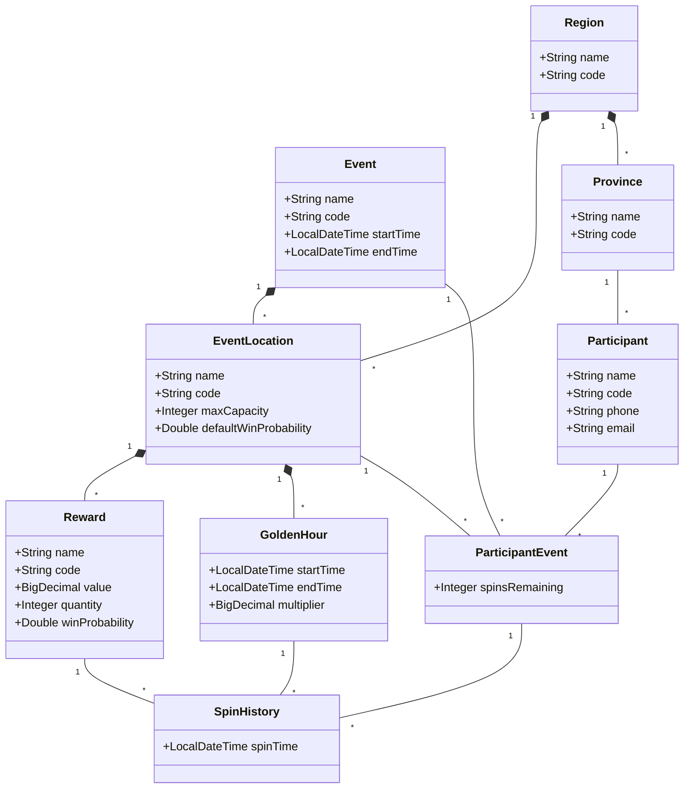
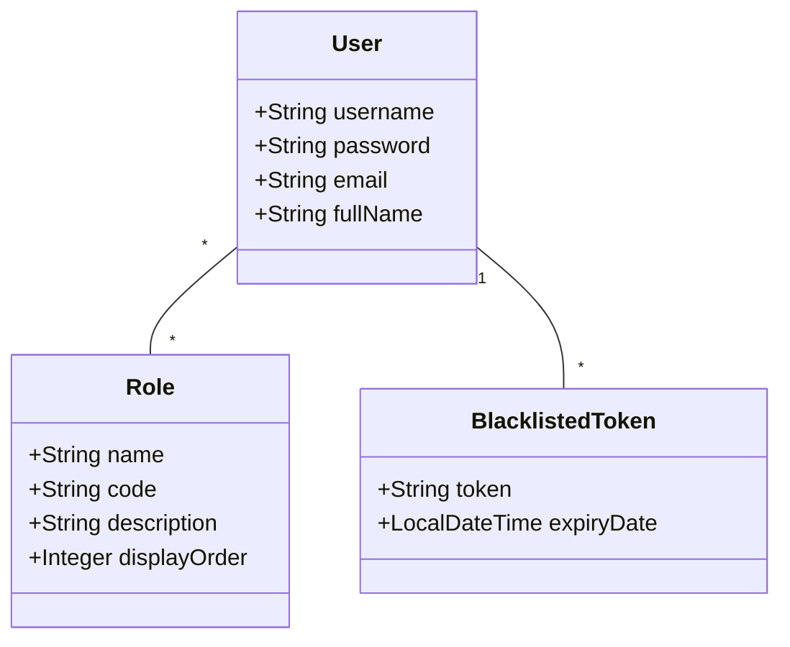

# Lucky Draw Project Overview

## Domain Model

### Core Entities

### Support Entities

#### Event
- Represents a lucky draw event
- Has start and end times
- Contains multiple locations
- Defines maximum participants and spins per participant
- Manages participant registrations

#### EventLocation
- Physical location where an event takes place
- Belongs to a region
- Has maximum capacity
- Has default win probability
- Contains rewards and golden hours
- Manages daily spin limits

#### Reward
- Prize that can be won in a location
- Has value and quantity
- Belongs to an event location
- Has win probability
- Manages inventory

#### GoldenHour
- Special time period in a location with multiplied rewards
- Has start and end times
- Belongs to an event location
- Defines reward multiplier

#### Region
- Geographic region (e.g., North, South)
- Contains provinces
- Manages event locations

#### Province
- Administrative province
- Belongs to a region
- Used for participant registration

#### Participant
- Person participating in events
- Has basic profile information
- From a province
- Can join multiple events

#### ParticipantEvent
- Links participant to event and location
- Tracks remaining spins
- Records spin history

#### SpinHistory
- Records spin attempts
- Links to reward if won
- Tracks golden hour multipliers
- Belongs to participant event

### Support Entities

#### User
- System user (admin, staff)
- Has roles and permissions
- Manages events and locations

#### Role
- User role definition
- Contains permissions
- Used for access control

#### BlacklistedToken
- Tracks invalidated JWT tokens
- Used for session management

## Key Features

1. Event Management
   - Create and manage events
   - Configure locations and rewards
   - Set golden hours
   - Monitor participation

2. Participant Registration
   - Register participants
   - Validate eligibility
   - Track participation

3. Spin Management
   - Process spin attempts
   - Apply golden hour multipliers
   - Track reward inventory
   - Manage location capacity

4. Reward Management
   - Configure rewards by location
   - Track inventory
   - Set win probabilities

5. Access Control
   - User authentication
   - Role-based permissions
   - Token management

## Technical Stack

- Java 17
- Spring Boot 3
- Spring Security with JWT
- Spring Data JPA
- PostgreSQL
- Gradle
- JUnit 5