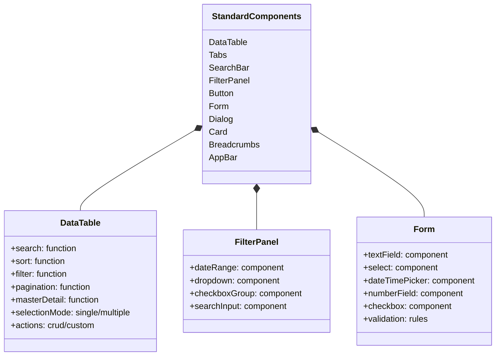
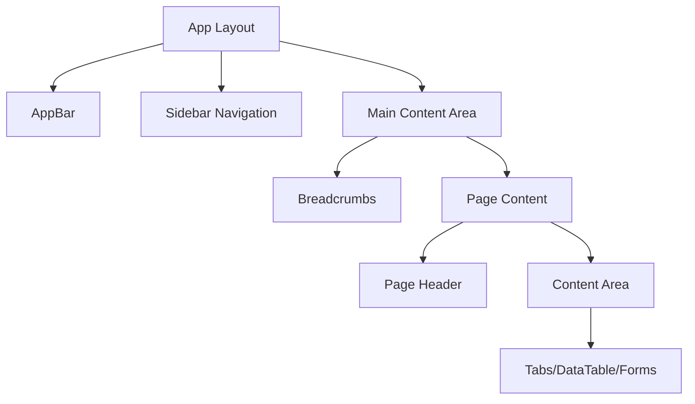
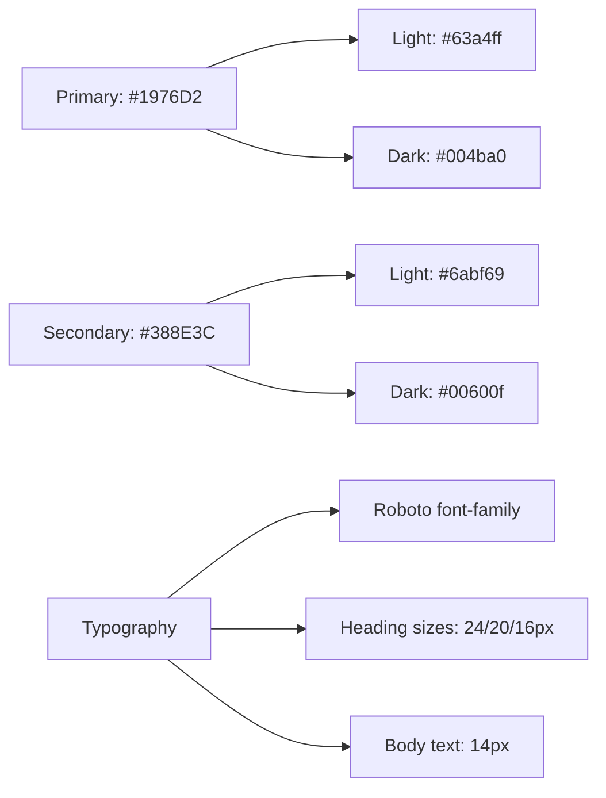
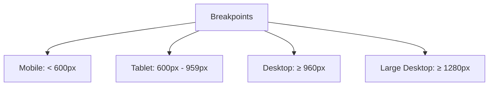

# Lucky Draw System UI Design System

## 1. Standard Components Library



### 1.1 DataTable Component
- **Search**: Global search across all columns
- **Sort**: Click column headers to sort ascending/descending
- **Filter**: Column-specific filters in header
- **Pagination**: 10/25/50/100 rows per page
- **Selection**: Single/multiple row selection
- **Actions**: CRUD operations + custom actions
- **Responsive**: Horizontal scroll on mobile
- **Export**: CSV/Excel export option

#### 1.1.1 Master/Detail View
- **Expandable Rows**: Click to expand/collapse row details
- **Detail Templates**: Customizable detail view layouts
- **Tabs in Details**: Organize related information
- **Lazy Loading**: Load detail data on demand
- **Reference Data Display**: Show related entity information
- **Quick Actions**: Perform actions from detail view
- **Sub-tables**: Display related records in detail view

Example Detail Views:
1. **Event Row Details**:
   - Tabs:
     - Locations (sub-table with location details)
       * Location name, region, capacity, status
       * Quick actions: edit, delete, view details
       * Filtering and sorting capabilities
     - Participants (sub-table with participant list)
       * Participant name, code, province, status
       * Registration date and spins remaining
       * Quick actions: view history, update spins
     - Rewards (sub-table with rewards list)
       * Reward name, value, quantity, status
       * Inventory tracking by location
       * Quick actions: edit quantity, view winners
     - Golden Hours (sub-table with golden hours list)
       * Start time, end time, multiplier
       * Status and upcoming schedule
       * Quick actions: edit, delete, add new
     - Statistics (charts/metrics)
       * Participation rates by location
       * Win rates and distribution
       * Reward allocation status
       * Golden hour performance
     - Audit Log (changes history)
       * Timestamp and action type
       * User who made the change
       * Before/after values
       * Filtering by action type

2. **Participant Row Details**:
   - Tabs:
     - Profile (detailed participant info)
     - Events (sub-table of participated events)
     - Spin History (sub-table with spin results)
     - Rewards (sub-table of won prizes)

3. **Reward Row Details**:
   - Tabs:
     - Details (reward specifications)
     - Inventory (stock status by location)
     - Winners (sub-table of winners)
     - Distribution Stats (charts/metrics)

### 1.2 FilterPanel Component
- **DateRange**: Start/end date picker
- **Dropdown**: Single/multiple selection
- **CheckboxGroup**: Multiple selection
- **SearchInput**: Text search with suggestions
- **Clear All**: Reset all filters
- **Apply**: Apply selected filters
- **Save**: Save filter preferences

### 1.3 Form Components
- **TextField**: Input validation & hints
- **Select**: Single/multiple with search
- **DateTimePicker**: Calendar + time selection
- **NumberField**: With min/max validation
- **Checkbox**: Single/group selection
- **ValidationRules**: Required/pattern/custom

## 2. Layout Structure



### 2.1 AppBar
- Fixed position at top
- System logo & name
- User profile menu
- Notifications
- Quick actions

### 2.2 Sidebar Navigation
- Collapsible menu
- Icon + text labels
- Active state indicators
- Section grouping
- Keyboard navigation

### 2.3 Main Content Area
- Responsive padding
- Breadcrumb navigation
- Page title & actions
- Content container

### 3.6 Lucky Draw Wheel Screens
#### Event Screen
- **Preview Tab**: Allows admins or system operators to preview the Lucky Draw Wheel settings and simulate draws.
- **Reward Preview**: Displays the configured rewards for verification.

#### Participant Screen
- **Input Fields**:
  - Contract/Account number
  - Registered national ID
  - Registered phone number
  - Contact phone number for SMS notifications
- **Prize Display**:
  - Shows the won prize when a participant wins.
  - Displays an address field for winners to provide their address (auto-filled if previously provided).

```mermaid
graph TD
    A[Event Screen] --> B[Preview Tab]
    B --> C[Simulate Draw]
    A --> D[Reward Preview]

    E[Participant Screen] --> F[Input Fields]
    F --> G[Contract/Account Number]
    F --> H[Registered National ID]
    F --> I[Registered Phone Number]
    F --> J[Contact Phone Number]
    E --> K[Prize Display]
    K --> L[Address Field (Auto-filled if available)]
```
## 3. Page Mockups

### 3.1 Event Management View
#### Events List Tab
- **DataTable Columns**:
  - Name (sortable)
  - Code (filterable)
  - Start Time (sortable, filterable)
  - End Time (sortable, filterable)
  - Status (filterable)
  - Actions (edit, delete, view)
- **Filter Panel**:
  - Date Range
  - Status
  - Search by name/code
- **Master/Detail View**:
  - Detail Tabs:
    1. Locations
       - Location list with capacity and status
       - Quick add/edit location
    2. Participants
       - Registered participants list
       - Registration statistics
    3. Rewards
       - Reward configuration by location
       - Inventory status
    4. Activity
       - Recent spins
       - Win rate statistics

#### Event Locations Tab
- **DataTable Columns**:
  - Location Name (sortable)
  - Region (filterable)
  - Max Capacity (sortable)
  - Default Win Probability (sortable)
  - Status (filterable)
  - Actions (edit, delete, view)
- **Filter Panel**:
  - Region selection
  - Status
  - Capacity range
- **Master/Detail View**:
  - Detail Tabs:
    1. Rewards
       - Assigned rewards
       - Inventory levels
    2. Golden Hours
       - Scheduled golden hours
       - Multiplier settings
    3. Statistics
       - Participation metrics
       - Win rates

### 3.2 Reward Management View
#### Rewards Tab
- **DataTable Columns**:
  - Code (filterable)
  - Name (sortable)
  - Image
  - Value (sortable)
  - Quantity (sortable)
  - Duration Type (filterable)
  - Status (filterable)
  - Actions (edit, delete, view)
- **Filter Panel**:
  - Location selection
  - Duration Type
  - Value range
  - Status
- **Master/Detail View**:
  - Detail Tabs:
    1. Inventory
       - Stock by location
       - Distribution history
    2. Winners
       - Recent winners
       - Win statistics
    3. Settings
       - Probability settings
       - Duration rules

#### Golden Hours Tab
- **DataTable Columns**:
  - Location (filterable)
  - Start Time (sortable)
  - End Time (sortable)
  - Multiplier (sortable)
  - Status (filterable)
  - Actions (edit, delete)
- **Filter Panel**:
  - Location selection
  - Date range
  - Multiplier range
- **Master/Detail View**:
  - Detail Tabs:
    1. Schedule
       - Recurring pattern
       - Exception dates
    2. Performance
       - Win rate changes
       - Participation spikes
    3. History
       - Past results
       - Impact analysis

### 3.3 Participant Management View
#### Participants Tab
- **DataTable Columns**:
  - Name (sortable)
  - Code (filterable)
  - Phone (searchable)
  - Email (searchable)
  - Province (filterable)
  - Status (filterable)
  - Actions (edit, delete, view)
- **Filter Panel**:
  - Province selection
  - Region selection
  - Status
  - Registration date range
- **Master/Detail View**:
  - Detail Tabs:
    1. Profile
       - Personal information
       - Contact details
    2. Events
       - Registered events
       - Participation history
    3. Rewards
       - Won prizes
       - Claim status
    4. Activity
       - Recent spins
       - Win statistics

#### Participant Events Tab
- **DataTable Columns**:
  - Participant (sortable)
  - Event (filterable)
  - Location (filterable)
  - Spins Remaining (sortable)
  - Status (filterable)
  - Actions (view history)
- **Filter Panel**:
  - Event selection
  - Location selection
  - Date range
  - Spins range
- **Master/Detail View**:
  - Detail Tabs:
    1. Spins
       - Spin history
       - Rewards won
    2. Event Details
       - Event information
       - Location details
    3. Statistics
       - Win rate
       - Participation metrics

### 3.4 Spin History View
- **DataTable Columns**:
  - Participant (sortable)
  - Event (filterable)
  - Location (filterable)
  - Spin Time (sortable)
  - Reward (filterable)
  - Golden Hour Multiplier (sortable)
  - Actions (view details)
- **Advanced Filter Panel**:
  - Event selection
  - Location selection
  - Date range
  - Reward type
  - With/without multiplier
- **Master/Detail View**:
  - Detail Tabs:
    1. Spin Details
       - Complete spin information
       - Applied rules/multipliers
    2. Participant
       - Quick participant profile
       - Recent activity
    3. Event Context
       - Event/location status
       - Current probabilities

### 3.5 User Management View
#### Users Tab
- **DataTable Columns**:
  - Username (sortable)
  - Full Name (sortable)
  - Email (searchable)
  - Roles (filterable)
  - Status (filterable)
  - Actions (edit, delete, reset password)
- **Filter Panel**:
  - Role selection
  - Status
  - Creation date range
- **Master/Detail View**:
  - Detail Tabs:
    1. Profile
       - User information
       - Role assignments
    2. Activity
       - Login history
       - Action logs
    3. Permissions
       - Detailed permissions
       - Access history

#### Roles Tab
- **DataTable Columns**:
  - Name (sortable)
  - Code (filterable)
  - Description (searchable)
  - Display Order (sortable)
  - Actions (edit, delete)
- **Filter Panel**:
  - Search by name/code
- **Master/Detail View**:
  - Detail Tabs:
    1. Permissions
       - Permission matrix
       - Resource access
    2. Users
       - Assigned users
       - Role usage stats
    3. Audit
       - Change history
       - Access logs

## 4. Color Scheme and Typography



### 4.1 Color Usage
- **Primary**: Navigation, buttons, links
- **Primary Light**: Hover states, backgrounds
- **Primary Dark**: Active states, emphasis
- **Secondary**: Success, completion, positive actions
- **Secondary Light**: Success backgrounds, highlights
- **Secondary Dark**: Intensive success states

### 4.2 Typography
- **Font Family**: Roboto
- **Heading Sizes**:
  - H1: 24px/1.5 (page titles)
  - H2: 20px/1.5 (section headers)
  - H3: 16px/1.5 (subsection headers)
- **Body Text**: 14px/1.5
- **Small Text**: 12px/1.4
- **Font Weights**:
  - Regular: 400
  - Medium: 500
  - Bold: 700

## 5. Component States and Interactions

```mermaid
stateDiagram-v2
    [*] --> Default
    Default --> Hover: Mouse over
    Hover --> Active: Click
    Active --> Disabled: Disable
    Disabled --> Default: Enable
    Default --> Focus: Tab/Click
    Focus --> Default: Blur
```

### 5.1 Interactive States
- **Default**: Normal state
- **Hover**: Visual feedback on mouse over
- **Active**: Pressed/selected state
- **Focus**: Keyboard navigation state
- **Disabled**: Unavailable state

### 5.2 Loading States
- Skeleton loading for tables
- Progress indicators for actions
- Loading overlays for forms
- Inline loading for buttons

### 5.3 Error States
- Form validation errors
- Error messages
- Error boundaries
- Network error handling

### 5.4 Success States
- Action confirmations
- Success messages
- Completion indicators
- Positive feedback

### 5.5 Master/Detail States
- **Row Expansion**:
  - Smooth animation
  - Loading indicator
  - Error handling
  - Empty state
- **Tab Navigation**:
  - Active tab highlight
  - Loading states
  - Error states
  - Data persistence

## 6. Responsive Design Guidelines

### 6.1 Breakpoints


### 6.2 Layout Adaptations
- **Sidebar Navigation**:
  - Desktop: Full expanded view
  - Tablet: Collapsible, icon + text
  - Mobile: Hidden by default, slide-out menu

- **Data Tables**:
  - Desktop: Full view with all columns
  - Tablet: Scrollable horizontally, prioritized columns
  - Mobile:
    * Card view for better readability
    * Stack important columns vertically
    * Collapse secondary information

- **Master/Detail Views**:
  - Desktop: Side-by-side view
    * Master: 40% width
    * Detail: 60% width
  - Tablet:
    * Expandable rows
    * Detail view opens in modal
  - Mobile:
    * Full-screen detail view
    * Back button navigation

### 6.3 Component Adaptations

#### DataTable Responsive Behavior
- **Desktop**:
  * Show all columns
  * Inline actions
  * Advanced filtering
  * Multi-select enabled

- **Tablet**:
  * Hide low-priority columns
  * Scrollable horizontally
  * Action menu for multiple actions
  * Simplified filtering

- **Mobile**:
  * Card layout transformation
  * Essential information only
  * Full-screen filters
  * Single-item actions

#### Master/Detail Responsive Patterns
- **Desktop**:
  * Two-panel layout
  * Persistent detail view
  * Quick actions visible
  * Multiple tabs visible

- **Tablet**:
  * Modal detail view
  * Slide-in panel
  * Collapsible sections
  * Tab dropdown for overflow

- **Mobile**:
  * Full-screen detail view
  * Bottom sheet for quick info
  * Simplified tab navigation
  * Focus on primary actions

### 6.4 Touch Interactions
- **Desktop**:
  * Hover states
  * Click actions
  * Keyboard navigation
  * Tooltip hints

- **Tablet/Mobile**:
  * Touch targets (min 48x48px)
  * Swipe gestures
  * Pull-to-refresh
  * Bottom navigation
  * Floating action buttons

### 6.5 Performance Considerations
- **Data Loading**:
  * Progressive loading on scroll
  * Reduced data set for mobile
  * Image optimization
  * Cached views

- **Animations**:
  * Reduced motion for mobile
  * Hardware acceleration
  * Optimized transitions
  * Selective content updates